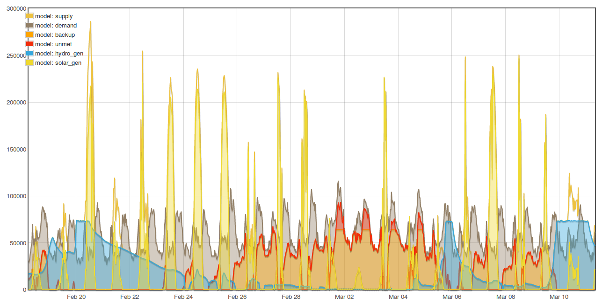

## title: Exploring Community Energy Supply, Matching Supply and Demand
### published: 2019-3-21

Now that we have more than one year of half hourly generation data from both the Bethesda and Llanberis run of the river hydro generators, its a good point to assess how well hydro generation matches local electricity demand and how the combination of different technologies including: solar, wind, storage and backup AD gas turbines can provide a zero carbon electricity supply that matches demand at all times.

On an annual basis the [100kW Afon Berthen hydro](http://www.ellergreen.com/hydro/portfolio-item/berthen/) generates ~90% of the electricity demand of the ~110 households. The hydro generates a lot of electricity when it rains, its output then tails off when the rain stops, it is a run of the river system, there is no dam to store the water for later use when needed. Luckily it rains quite a bit here and it rains more in winter than in summer, matching the seasonal pattern of demand quite well. This said there are still substantial periods where the hydro generates more electricity than the households can consume and other periods where the hydro is not generating enough.

Selecting the period starting 1st of August 2017 through to the 1st of August 2018, a period where the number of households in the study stayed mostly constant, we find that the output from the hydro supplied ~60% of the household electricity demand directly. The screenshot below of this period shows a plentiful winter followed by the incredible dry summer resulting in almost 2 months of zero generation:

Explore the dashboard: [https://dashboard.energylocal.org.uk/](https://dashboard.energylocal.org.uk/)

### Building an Energy Model

In order to assess how we can reach 100% matching of supply and demand we need a model! The following set of examples and discussion starts from a basic model looking at current levels of matching and then expands through to a more complex model that takes into account, solar, batteries and backup biogas.

**Model 1**

The first model works by loading in the Afon Berthen hydro and community consumption data, available in half hourly intervals for the entire year. It then subtracts the community demand from the hydro supply to calculate the balance at every interval. If the balance is positive this means there is excess hydro and the total amount of excess hydro is recorded. If the balance is negative, this means that there is unmet demand and the total amount is again recorded. The results of the model run are printed at the end.

Take a look at the source code here for a clearer look at how it works: 
[https://github.com/TrystanLea/hydromodel/blob/master/1.php](https://github.com/TrystanLea/hydromodel/blob/master/1.php)

**Model run results:**

    Hydro generation:             348943 kWh
    Community demand:             391039 kWh
    Excess Hydro:                 113377 kWh
    Grid Import:                  155473 kWh
    Demand supplied by hydro:     60.2 %
    Hydro self consumption:       67.5 %
    Average CO2 Intensity:        113 gCO2/kWh
    
We can see here the 60% matching mentioned above which is the main result of this simple model. As an aside the model calculates the resulting carbon intensity of the electricity supply assuming imported grid electricity is roughly equal to the UK average carbon intensity in 2018 of [283 gCO2/kWh](https://www.gov.uk/government/publications/greenhouse-gas-reporting-conversion-factors-2018), the community average CO2 intensity works out to 283 gCO2/kWh x 40% backup = 113 gCO2/kWh, a good starting point!

**Technical note:** The model is designed for use in conjunction with emoncms which is used for the original data collection and to graph the model results. Emoncms is open source and available for download here: [http://github.com/emoncms/emoncms](http://github.com/emoncms/emoncms). To run the model yourself follow the guide here: RUN THE MODEL GUIDE

### What if the hydro turbine was larger?

On an annual basis the hydro generated 89% of the community demand. We can use the model to assess what would happen if we increased the size of the hydro. The capacity of the hydro is specified on [line 17](https://github.com/TrystanLea/hydromodel/blob/master/1.php#L17) and can be adjusted to model different sizing.

**Results:**

If the hydro output is increased to match the annual community demand the demand supplied by the hydro increases to 62.7% and the percentage of hydro self consumption would also be **62.7%**
 11% more output gives 2.5% more matching.

If we increased the size of the hydro to generate 120% of the community demand on an annual basis the demand supplied by the hydro would increase to **66.4%**
 20% more output gives 3.7% more matching.

If we increased the size of the hydro to generate 200% of the community demand on an annual basis the demand supplied by the hydro would increase to **73.7%**
 100% more output gives 11.0% more matching.

As we can see over-supply can increase the amount of demand supplied by the hydro but we see diminishing returns. Over supplying and potentially curtailing excess renewable energy is however an important technique used to increase matching. It can be cheaper to over-supply than build alternative infrastructure in certain cases.

### A big battery?

A common suggestion perhaps is to add a big battery to store the electricity from the times of excess to times where there is not enough hydro to meet demand. What if all 110 households had a Tesla PowerWall with a fully usable capacity of 7.0 kWh, providing a total of 770 kWh of battery storage?

Model 2 introduces a basic battery store which is charged when supply exceeds demand and discharged when supply is not enough. The balance after the battery is calculated and remaining excess and unmet demand recorded: 
[https://github.com/TrystanLea/hydromodel/blob/master/2.php](https://github.com/TrystanLea/hydromodel/blob/master/2.php)

The following screen shot shows a couple of days in April where the hydro output decays due to dry weather and demand exceeds supply. The black line shows the amount of energy stored in the battery, we can see how it is drawn down during this period:

Running the model with 7.0 kWh of battery storage per household (770 kWh) and scaling hydro to meet annual demand increases matching from 62.7% to **68.8%** (+6.1%). The same additional level of matching could be achieved by increasing the hydro capacity by 35%.

    Hydro generation:             391025 kWh
    Community demand:             391039 kWh
    Excess Hydro:                 119804 kWh
    Grid Import:                  121973 kWh
    Demand supplied by hydro:     68.8 %
    Hydro self consumption:       69.4 %
    Average CO2 Intensity:        88gCO2/kWh

Running the model with 100 kWh of battery storage per household (6000 kWh) increases matching from 62.7% to **81.7%** (+19.0%).

    Excess Hydro:                 69328 kWh
    Grid Import:                  71546 kWh
    Demand supplied by hydro:     81.7 %
    Hydro self consumption:       82.3 %
    Average CO2 Intensity:        52gCO2/kWh
    
Running the model with 500 kWh of battery storage per household (30,000 kWh) increases matching from 62.7% to **92.5%** (+29.8%).

    Excess Hydro:                 45743 kWh
    Grid Import:                  29360 kWh
    Demand supplied by hydro:     92.5 %
    Hydro self consumption:       88.3 %
    Average CO2 Intensity:        21gCO2/kWh

While the above results don’t look great, don't discount batteries yet, the real solution is a mixture of a broad range of technologies. We will come back to batteries in a bit.

### Combining Hydro with Solar

Solar with hydro would seam the perfect pairing, drier, sunnier spells should make up for the low hydro output. The following model runs introduce data from a nearby household solar PV system for the same period. The solar is normalised and scaled to produce a proportion of annual demand. The capacity of the hydro is reduced by an equal amount so that the total generation remains constant. The solar supply is added to the hydro supply and the balance, excess and unmet totals are recorded as above.

Model source code: 
[https://github.com/TrystanLea/hydromodel/blob/master/3.php](https://github.com/TrystanLea/hydromodel/blob/master/3.php)

**Model run results:**

    100% Hydro, 0% solar: 62.75%
    90% Hydro, 10% solar: 66.45%
    80% Hydro, 20% solar: 67.20%
    70% Hydro, 30% solar: 66.38%
    
As expected, solar does increase the matching between supply and demand. Peak matching occurs when the solar provides 20% of the demand. Which is equivalent to 900W of solar per household. Adding solar and reducing hydro by an equal amount, increased overall matching by +4.45%. Alternatively this increase could have been achieved by over-sizing the hydro by 26% or installing 4.0 kWh of battery storage per household.

**+ Oversupply**

As above if we oversupply hydro and solar to 120% of annual demand we can push up the matching level a bit further (Peak matching occurs again very close to 20% solar):

    120% Hydro, 0% solar: 66.35%
    108% Hydro, 12% solar: 70.71%
    96% Hydro, 24% solar: 71.62%
    84% Hydro, 36% solar: 71.04%
    
The maximum level of matching here is 5.2% above the hydro only oversupply result.

**+ Battery storage**

Introducing battery storage for the non-oversupply generation levels

    100% Hydro, 0% solar, 7.0 kWh battery: 68.81%
    90% Hydro, 10% solar, 7.0 kWh battery: 73.62%
    80% Hydro, 20% solar, 7.0 kWh battery: 77.89%
    70% Hydro, 30% solar, 7.0 kWh battery: 81.62%
    60% Hydro, 40% solar, 7.0 kWh battery: 83.84%
    50% Hydro, 50% solar, 7.0 kWh battery: 82.99%

There are two interesting things to note here, the first is that a 7.0 kWh store when combined with hydro and solar provides +16.64% of additional matching, almost 3x the benefit of the hydro case alone. You could say that run of the river hydro already contains an element of storage in the form of the absorbtion and later release of rain from the land in the catchment area, adding a small battery store provides less benefit than it does for solar which is a more direct form of energy.

We also see the optimum hydro/solar proportion point move closer together at 60% hydro and 40% solar, equivalent to 1.8 kW of solar per household. The battery makes the solar generation much more useful.

If we oversupply hydro and solar to 120% of annual demand and include a 7.0 kWh/household battery store, matching increases all the way up to **90.3%** and the optimum point moves to 55% hydro and 45% solar. 

The following screenshot shows what this combination looks like and covers the same April 5th to 25th period as the graph above. We can still see a brief blip of unmet demand but its extent is much reduced. The second period of unmet demand is no longer present, the battery maintains enough capacity to see it through. Unfortunately April 13th was both a low solar output day and a low hydro output day which led to the emptying of the battery and resulting unmet demand. 

**The combination of hydro, solar, oversupply and 7.0 kWh battery meets matching levels equivalent to the 500 kWh battery store run above but with a battery a fraction of the size.** Which goes to show how by combining benefits of more diverse set of technologies you can get much further. If the battery store is increased to 9.0 kWh per household the blip of unmet demand on the 13th of April disappears. 100% supply demand matching could be achieved with 200 kWh of battery storage per household.

If we oversupplied solar further with each household having the equivalent of a 3.8 kWp solar array the battery storage size to meet **100%** supply demand matching would reduce to 100 kWh per household. Which while still a large battery and too expensive in the short term, is not that far off the size of longer range electric car batteries today. Perhaps with further advances in battery technology and cost reduction this could be a possibility in future?

### Biogas Backup

A likely less expensive option to a large battery is to provide the remaining 10% of demand with a gas turbine running on biogas from an anaerobic digester. The ZeroCarbonBritian scenario developed by the Centre for Alternative Technology uses this approach to realise a 100% zero carbon electricity supply. ZCB also includes more novel technologies to upgrade the methane ratio in biogas in order to reduce the land use associated with providing this backup supply.

The final model in this series models a backup biogas or synthetic methane gas turbine. The battery model is adjusted to focus on peak reduction, allowing the gas turbine to run with a smoother output as well as reducing the maximum capacity needed.

[https://github.com/TrystanLea/hydromodel/blob/master/4.php](https://github.com/TrystanLea/hydromodel/blob/master/4.php)

With the gas turbine capacity set to 580W per household (63.8kW of capacity for all 110 households), the model outputs the following:

    Hydro:                             258088 kWh (39.8%)
    Solar:                             211173 kWh (9.1%)
    Renewable generation:              469261 kWh
    Community demand:                  391052 kWh
    Oversupply:                        120.0 %
    Excess:                            116866 kWh
    Unmet:                             408 kWh
    Backup:                            46623 kWh
    Demand supplied after backup:      99.90 %
    Renewable self consumption:        75.10 %
    Average CO2 Intensity:             0 gCO2/kWh

It's interesting to reflect on how the final 'Demand supplied after backup' changes as we adjust the maximum capacity of the gas turbine. 

    760W    99.99%
    --------------
    580W    99.90%
    518W    99.80%
    475W    99.70%
    446W    99.60%
    422W    99.50%
    --------------
    344W    99.00%

344W per household gets us from 90.3% to 99.0%. The final 0.99% matching requires 2.2x this amount. We can see that there is an cost/benefit optimisation point to consider here. 

The greatest period of unmet demand occurs at the start of March 2018. Where a period of low solar output, low hydro output and [very cold weather](https://en.wikipedia.org/wiki/2018_Great_Britain_and_Ireland_cold_wave) all happened at the same time. This period was very windy though, with very consistent period of high wind output from UK wind farms from February 28th to March 3rd, if we included a mix of wind power in the model perhaps the result would be better!

**Land requirement for biogas backup**

How much land would we have needed to generate the quantity of backup biogas needed?

Assuming a 40% efficient gas turbine, 46,623 kWh of backup electric would require 116,558 kWh of biogas. Anaerobic digestion has an efficiency of ~57% and so we would need 200,961 kWh of input biomass.
Rotational grasses used for biodigestion have a biomass energy yield of 44,840 kWh/ha/yr [https://learn.openenergymonitor.org/sustainable-energy/energy/renewableheat](https://learn.openenergymonitor.org/sustainable-energy/energy/renewableheat) and so we would need ~4.5 hectares (407 m2 per household, or 4.4% of each households share of UK land area). This is broadly in line with the level of biomass use for backup electricity calculated in models such as ZeroCarbonBritain.

### Flexible Demand

The above scenarios have all focused on supply side measures and battery storage but have assumed that the demand itself is immovable. Neither does the analysis include projections for how demand changes as the adoption of electric cars and electrified heating with heat pumps increase. That said the overall proportions are very similar to more complete modelling that do take into account these factors. The general gist of combining renewable energy technologies, oversupply, storage and backup remain very similar. Flexibility in demand provides a very similar role to the battery storage discussed above and so can reduce the amount of dedicated battery storage required.

**Flexible demand examples:**

- Wind powered heat-pump heating with an externally insulated terraced house. [http://trystanlea.org.uk/thermalmass2](http://trystanlea.org.uk/thermalmass2). The building fabric is used as heat storage maintaining a relatively high indoor temperature across extended periods of low wind output in a primarily wind powered zero carbon energy system. 

- Solar self consumption looking at flexible water heating, EV charging and battery storage: [http://trystanlea.org.uk/solarselfconsumption](http://trystanlea.org.uk/solarselfconsumption)

- Smart charging model for electric vehicles: [https://learn.openenergymonitor.org/sustainable-energy/zcem/integrated.html#electricvehicles](https://learn.openenergymonitor.org/sustainable-energy/zcem/integrated.html#electricvehicles)

### Looking at costs

The above analysis really needs to take into account costs, the proportions of each technology used depends as much on cost as it does on the technical optimum proportions. I have explored costs before for a wind and solar system with backup gas turbines here: [https://learn.openenergymonitor.org/sustainable-energy/energy/costs](https://learn.openenergymonitor.org/sustainable-energy/energy/costs). It would be great to expand on the above with a similar analysis.
